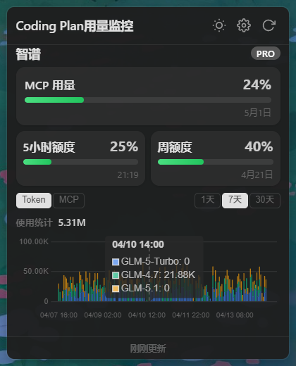
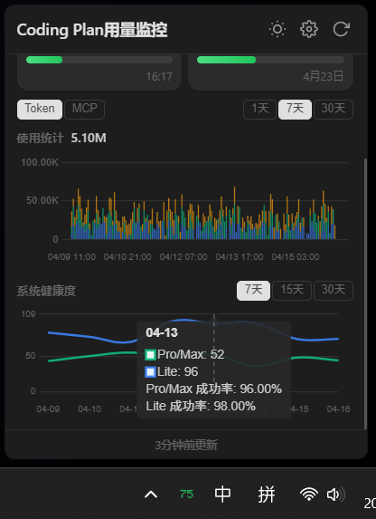

# Coding Quota Bar

Windows 系统托盘应用，实时监控 AI 平台 Coding Plan 用量配额。

常驻托盘，一眼掌握使用量，无需打开网页查看额度，不打断编码流程。

## 预览

### 截图

## 功能

- **托盘图标百分比** — 图标直接展示最低剩余百分比，颜色随阈值变化（绿 >50%、黄 20%-50%、红 <20%）
- **平台支持** — 智谱、Minimax
- **多账户** — 支持多个key同时查询，托盘显示默认显示最少额度的百分比
- **自动定时刷新** — 可配置刷新间隔，后台静默更新
- **弹窗详情面板** — 点击托盘图标查看各平台用量卡片、进度条、到期日期
- **用量趋势图表** — 柱状图展示使用趋势
- **设置面板** — 可视化配置 API Key、刷新间隔、开机自启等
- **配置热重载** — 修改配置后自动生效
- **开机自启动**
- **国际化** — 中文 / 英文

## 未来计划
- 并发测试功能，了解服务商到底提供了多少并发
- Mac 支持
- 更多Coding Plan服务商支持

## 安装

访问[Github Releases](https://github.com/hyizhou/coding-quota-bar/releases)下载并安装

## 反馈与交流

遇到问题或有建议？欢迎加入[飞书反馈群](https://applink.feishu.cn/client/chat/chatter/add_by_link?link_token=f15m4456-a99f-4dc1-9497-b40ff2196142)交流：

## License

MIT
