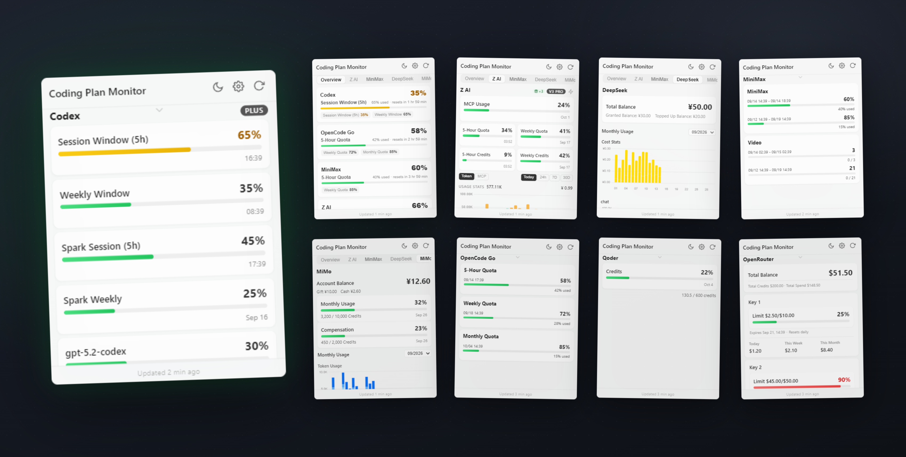

# Coding Quota Bar

**English** | [简体中文](README.zh-CN.md)

[](https://github.com/hyizhou/coding-quota-bar/releases/latest)
[](https://github.com/hyizhou/coding-quota-bar/releases)
[](https://apps.microsoft.com/detail/9P6D6QRN7G7D)


A Windows tray utility that monitors your Coding Plan usage across AI platforms in real time.

The tray icon shows the remaining percentage directly with color-coded alerts, so you can grasp your quota at a glance — no need to open web dashboards or break your coding flow.

## Preview



## Features

### Real-Time Tray Icon Display

The tray icon shows the remaining percentage directly, with its color changing by threshold:

- **Green** — over 50% left, use freely
- **Yellow** — 20%–50% left, watch your usage
- **Red** — under 20% left, time to conserve

The display rule is configurable: lowest or highest across all accounts, or pinned to a specific account — defaults to the lowest.

Hover over or click the icon to pop up the detail panel and view the usage details of every platform.

### Multi-Platform Support

| Platform | Auth | Usage Tracked |
|----------|------|---------------|
| **Z.ai** | API Key | 5-hour / weekly credit quotas (v3 credit-based) or request-count quotas (v1/v2), MCP usage, subscription tier (V1/V2/V3), usage trend charts, model performance, estimated cost |
| **DeepSeek** | API Key / Web login | Account balance (total / granted / topped-up), monthly usage, custom budget progress bar, 90-day uptime history of the API and web services |
| **MiniMax** | API Key | 5-hour / weekly quotas (percentage-based) |
| **MiMo** | Web login | Total plan usage, monthly usage, token usage estimate, account balance |
| **OpenCode Go** | API Key | 5-hour rolling window, weekly quota, monthly quota |
| **Codex** | Reads the local Codex CLI login | Primary/secondary rate-limit windows, code review quota, credits balance, rate-limit resets, usage stats, subscription expiry |
| **OpenRouter** | API Key (multiple keys) | Per-key limits and expiry, total balance, today/week/month spend, lifetime top-ups and spend |
| **Qoder** | Web login / pasted cookie | big model credits quota (primary + shared quotas merged), reset countdown; supports the global and China sites |
| **StepFun** | Web login / pasted token | Step Plan quotas (rate windows or credits + top-up packs), account balance, credit usage charts |

### Multi-Account Management

Configure multiple API keys for the same platform — for example, monitor your work and test accounts at the same time. With multiple accounts, a tab switcher appears automatically, and the tray icon follows the account with the lowest quota by default.

### Usage Trend Charts

- **Token usage bar chart** — 7 days at hourly granularity
- **MCP tool call stats** — usage frequency of search, web reading, ZRead, etc.
- **Model performance line chart** — decoding speed and success rate trends
- **Z.ai usage stats page** — one-year daily usage heatmap, this month/week vs. the previous period, usage streaks
- **Estimated cost** — API-equivalent amount estimated from token usage

### Service Status Monitoring

DeepSeek users can check the live status of the API service and the web chat service, including the current state, 90-day history, and uptime percentages.

### Other Features

- **Scheduled auto refresh** — configurable refresh interval from 1 to 30 minutes
- **Concurrency testing** — fire configurable concurrent requests at the Z.ai Coding Plan OpenAI / Anthropic endpoints, tracking first-token latency, output speed, and history
- **API key encryption** — system-level encryption via Windows safeStorage
- **Launch at startup**
- **Dark/light theme** — follow the system or switch manually
- **Internationalization** — Chinese / English
- **Auto update** — prompts you to download when a new version is detected

## Tech Stack

Electron 34 + Vue 3 + TypeScript + Vite 7

**Architecture highlights**:

- Provider plugin pattern — each AI platform is implemented independently and loaded dynamically through a registry
- Multi-account parallel scheduling — different providers are queried in parallel, while accounts under the same provider are queried serially to avoid rate limits
- Pure-code tray icon — rendered with a 5x7 bitmap font, no external image assets
- Compile-time config (`app.build.ts`) controls provider availability; runtime config manages user data

## Install

- [GitHub Releases](https://github.com/hyizhou/coding-quota-bar/releases) — NSIS installer with in-app auto updates
- Microsoft Store — store build (MSIX), with data fully separate from the NSIS build

### Build from Source

```bash
git clone https://github.com/hyizhou/coding-quota-bar.git
cd coding-quota-bar
npm install
npm run dev           # development mode
npm run package:win   # package the Windows installer
```

## License

MIT
